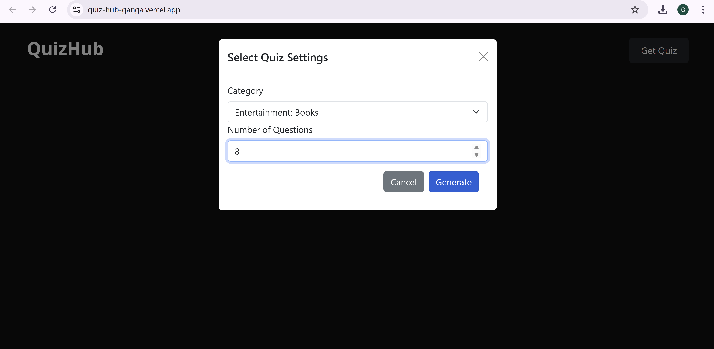
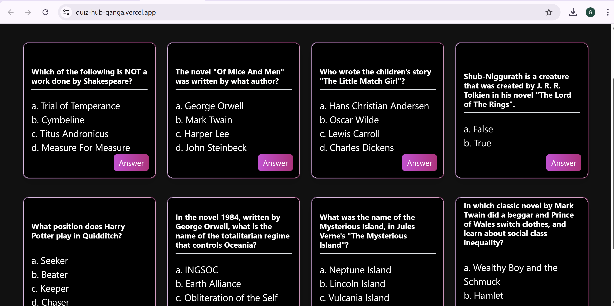
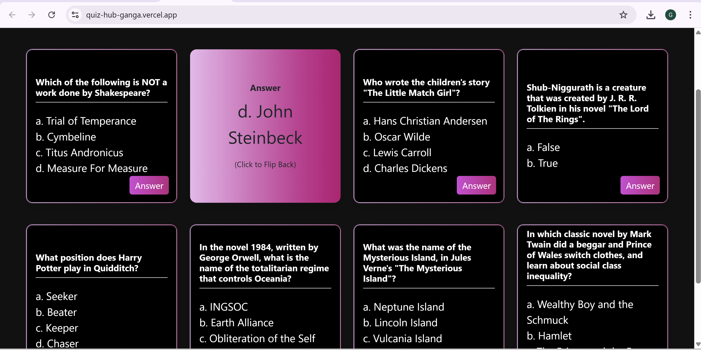

🎯 QuizHub

QuizHub is a lightweight and interactive quiz application built with **React** and **Vite**. It presents multiple-choice questions in a clean, card-like format where users can click an option to instantly see the correct answer — no scoring, no pressure. Just tap, learn, and enjoy.

🌐 **Live Demo**: [https://quiz-hub-ganga.vercel.app](https://quiz-hub-ganga.vercel.app)

---
 📸 Screenshots

 🏠 Home Page


❓ Question generation


 ❓ Question Reveal


 🧾 Answer Shown


---

 🚀 Features

- ✅ Click to reveal the correct answer
- 🧠 Learn-as-you-go format (no scoring)
- 💡 Minimalist UI for distraction-free focus
- 🔁 Retake or refresh for a new round
- 📱 Fully responsive design

---

🛠️ Tech Stack

| Technology  | Description                  |
|-------------|------------------------------|
| React       | Component-based frontend     |
| Vite        | Fast bundler and dev server  |
| JavaScript  | Core quiz logic              |
| HTML & CSS  | UI layout and design         |
| Vercel      | Deployment and hosting       |

---

📁 Project Structure

```bash
QuizHub/
├── public/                 # Static files
├── src/
│   ├── components/         # Quiz card UI
│   ├── App.jsx             # Main quiz logic
│   └── main.jsx            # Entry point
|   |___assets              # Screenshots
├── package.json
├── vite.config.js
└── README.md
